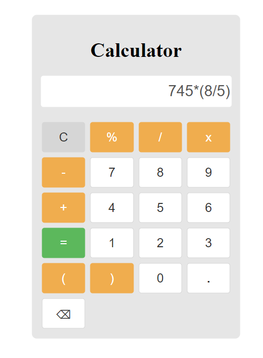

# Calculator

This is a basic calculator app built with React. It can perform simple arithmetic operations like addition, subtraction, multiplication, and division. The app has a user-friendly interface and is easy to use.

## Features
Addition

Subtraction

Multiplication

Division

Percentage Calculation

Brackets

Backspace to remove the last entered output

## Installation
Clone the repository or download the zip file.

Navigate to the project directory.

Run npm install to install the required dependencies.

Run npm start to start the app.

## Usage
Enter numbers and operators using the buttons on the calculator.

Use the "C" button to clear the input.

Use the "%" button to calculate percentages.

Use the "(" and ")" buttons to add brackets to the calculation.

Use the "⌫" button to remove the last entered output.

## Output

## Contributing
Contributions are always welcome! If you would like to contribute to this project, please fork the repository and create a pull request.

## License
This project is licensed under the MIT License. See the LICENSE.md file for details.
